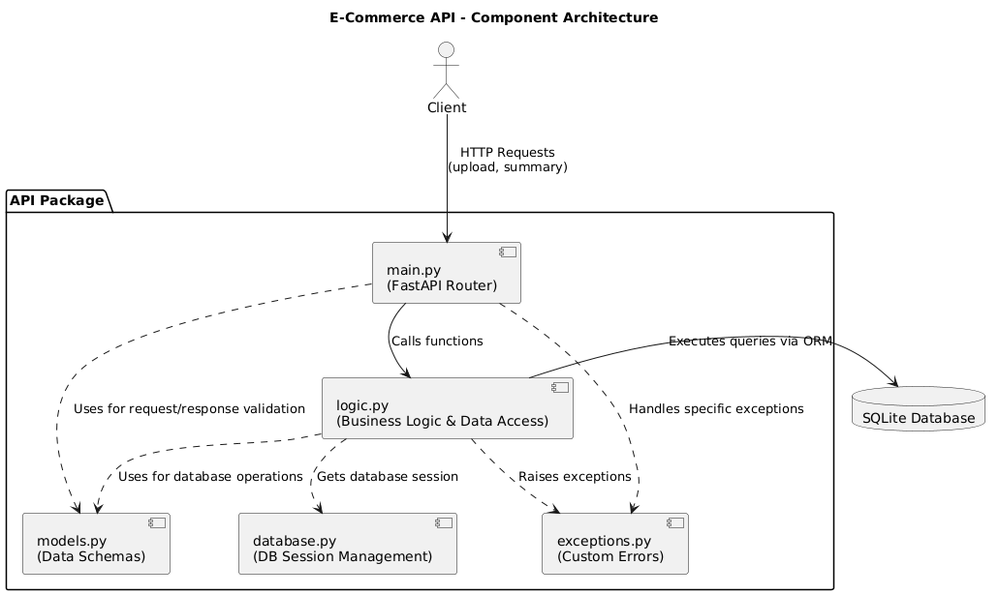
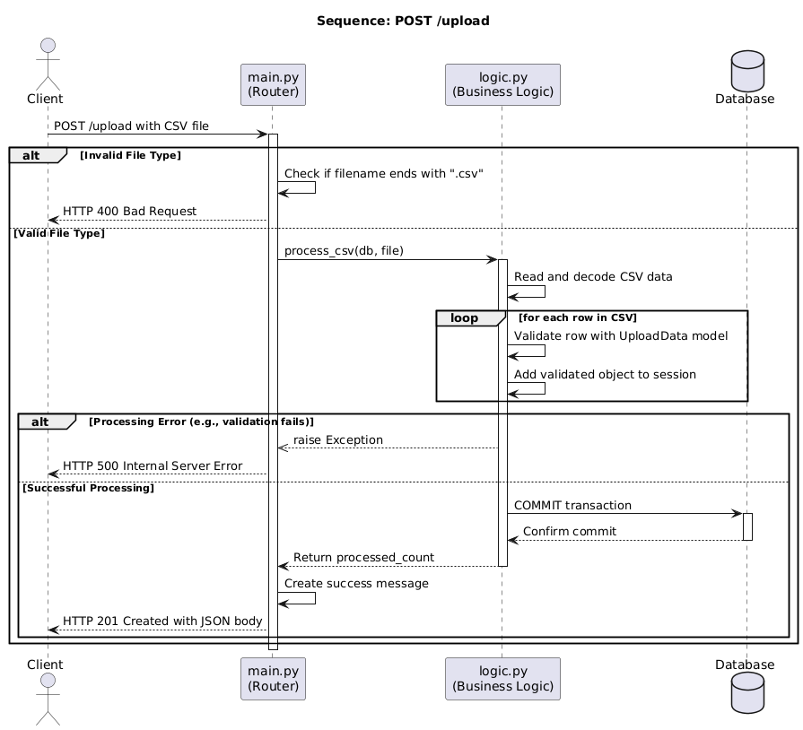
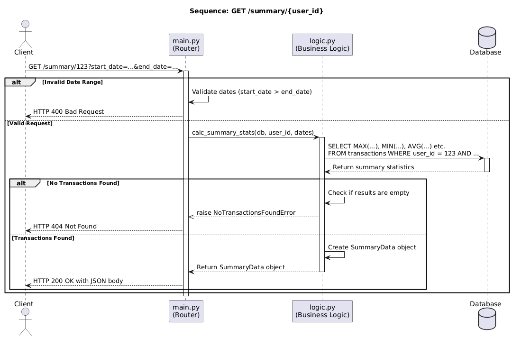

# E-Commerce Transaction API

This project is a RESTful API service developed in Python using the FastAPI framework. It has two endpoints /upload and /summary. The /upload endpoint accepts a CSV file upload and validates the file format before storing the data for processing in an SQLModel database. The /summary endpoint accepts a user ID and returns the summary statistics for the user including the maximum, minimum and mean transaction amount for that user. Optionally, the client can specify a start and end date in which transactions that will be included must lie in.

## Tech Stack

This project is built using the following stacky.

* **Framework:**
    * **FastAPI:** A web framework for building APIs.
    * **Uvicorn:** The ASGI server used to run the application.

* **Data & Validation:**
    * **SQLModel:** A library for interacting with SQL databases from Python code, with Python objects. It combines Pydantic and SQLAlchemy and is made by the creator of FastAPI.
    * **Pydantic:** Used for data validation and ensuring type hints are respected.
    * **python-multipart:** Required for handling the CSV uploads.

* **Testing:**
    * **Pytest:** The framework used for writing and running the test suite.
    * **HTTPX:** A fully featured HTTP client used within `TestClient` to make requests to the API during tests.

* **Development & Code Quality:**
    * **Black:** An uncompromising code formatter to ensure consistent style.
    * **pre-commit:** Used to manage and run pre-commit hooks that run the Black formatter prior to commits.
    * **Faker:** A library for generating fake data, used to create the sample `dummy_transactions.csv` file but not used in the main logic.

## Installation, Setup and Testing

* **Prerequisites:**
    * Python 3.12+
    * Git

The setup assumes that you are using a Linux system or WSL. To get the latest development version clone the repo using:

```bash
git clone git@github.com:MirjalilovS/ClientAPI.git
```

To setup the project please finput the following commands in the terminal:

```bash
python3 -m venv venv
source venv/bin/activate
pip install .
```

(Recommended) Set up pre-commit hooks for code formatting:

```bash
pip install pre-commit
pre-commit install
```

You can run all the unit tests through inputting the following command:

```bash
pytest
```

You can run tests in a specific module by running the following command:
```bash
pytest tests/chosen_test.py
```

Finally, you can run the app through the following command:

```bash
uvicorn api.main:app --reload
```

Then open https://127.0.0.1:8000/docs for the Swagger UI interactive documentation.

## API Endpoints
This section provides details on the available API endpoints.

### Upload Transactions
Uploads a CSV file containing transaction data to the database.

- **URL**: `/upload`
- **Method**: `POST`
- **Request Body**: `multipart/form-data`
  - **key**: `file`
  - **value**: The `.csv` file to be uploaded.

#### CSV File Format:
The CSV file must contain the following headers: `transaction_id`, `user_id`, `product_id`, `timestamp`, `transaction_amount`.

```csv
transaction_id,user_id,product_id,timestamp,transaction_amount
95494198-1b28-4b68-9fe1-48da933d0104,622,465,2024-11-03 19:17:50.813466,424.19
```

* **Responses:**
    * **201 Created (Success):** A JSON object confirming the number of processed transactions.
    ```json
    {
        "message": "Successfully uploaded and processed 10 transactions."
    }
    ```
    * **400 Bad Request:** The uploaded file is not a .csv file.
    * **500 Internal Servor Error:** An unexpected error occurred during file processing.

---

### Get User Summary
Retrieves summary statistics for a specific user's transactions, with an optional date range filter.

- **URL**: `/summary/{user_id}`
- **Method**: `GET`

**URL Parameters:**
- `user_id` (required): The integer ID of the user.

**Query Parameters:**
- `start_date` (optional): The start of the date range (inclusive). Format: `YYYY-MM-DDTHH:MM:SS`.
- `end_date` (optional): The end of the date range (inclusive). Format: `YYYY-MM-DDTHH:MM:SS`.

* **Responses:**
    * **200 OK:** A JSON object containing the summary statistics.
    ```json
    {
        "user_id": 1,
        "total_amount": 5430.50,
        "max_amount": 899.99,
        "min_amount": 10.25,
        "mean_amount": 181.02,
        "transaction_count": 30
    }
    ```
    * **400 Bad Request:** The provided start_date is later than the end_date.
    * **404 Not Found:** No transactions were found for the given user_id and date range.

## Architecture and Design Decisions

The application follows a packaged architecture. 

### Project Structure
```markdown
.
├── api/  
│   ├── __init__.py  
│   ├── main.py          # Entry point, routing, high-level exceptions  
│   ├── logic.py         # Core business logic and data processing  
│   ├── models.py        # SQLModel table models and API schemas  
│   ├── database.py      # Database engine, session management  
│   └── exceptions.py    # Custom exception classes  
├── tests/               # Unit and integration tests
│   ├── __init__.py
│   ├── api_test.py           # Contains all transactions
│   ├── dummy_transaction.csv # Used in upload_test.py to test efficiency
│   ├── upload_test.py        # Test that takes in sample CSV file. Can be used to test efficiency of upload endpoint           
├── pyproject.toml       # Project metadata and dependencies  
└── ...
```

### Module Breakdown
**`main.py`:** The entry point and routing layer. It uses FastAPI to define the API endpoints (`/upload`, `/summary/{user_id}`), handle HTTP requests and responses, and manage high-level exceptions.

**`logic.py`:** The core service module. It contains all business logic, including CSV file processing and the calculation of summary statistics. It interacts directly with the database using SQLModel to execute queries.

**`models.py`:** Defines all data structures and schemas using SQLModel. This includes models for database tables (e.g., `UploadData`) and schemas for API responses (e.g., `SummaryData`), ensuring data validation and consistency.

**`database.py`:** Responsible for database configuration. It handles the creation of the SQLite engine, session management (`SessionDep`), and initial table creation.

**`exceptions.py`:** Contains custom exception classes (e.g., `NoTransactionsFoundError`). This allows the application to handle specific error scenarios gracefully and return meaningful HTTP error codes and messages to the client.

### System Diagrams

#### Component Diagram
This diagram shows the high-level structure of the application.



#### Sequence Diagrams
These diagrams illustrate the flow of requests through the system for each endpoint.

**Upload Sequence:**


**Summary Sequence:**


---

### Key Design Decisions
**Framework Choice (FastAPI):** FastAPI was selected for its high performance, native async support, and automatic generation of interactive API documentation (via Swagger UI), which is invaluable for development and testing.

**ORM and Validation (SQLModel):** SQLModel was chosen because it elegantly combines the functionality of Pydantic and SQLAlchemy. It was created with FastAPI in mind and allows us to use a single class that serves as both a data validation schema and an ORM model for the data base.

**Database (SQLite):** For simplicity and ease of setup, a serverless SQLite database is used. This removes the need for a separate database server, making the application self-contained and easy to run locally. The database is created on application startup.

**CSV Processing Strategy:** To handle potentially very large CSV files without consuming excessive memory, the file is processed in a stream-like fashion, row by row. Data is validated and added to the database session in a loop, with a single `db.commit()` call at the end to ensure the entire upload is atomic (either all rows are saved, or none are). However, due to the limitations of the SQLite, we will need to migrate the project to a better database for greater efficiency.

**Centralised Business Logic:** Instead of splitting logic into a separate repository layer, all business and data access logic resides in `logic.py`. This is a pragmatic choice to maintain simplicity.


### Future Improvements

**Efficiency:** Currently there are severe efficiency issues when testing with 1,000,000 entry CSV's. The `upload_test.py` takes around 5 minutes to fully run. Although it passes this is quite slow. I think it is due to using SQLite which due to being a local database stored on the disk loses efficiency compared to using PostgreSQL. This along with the combination of using WSL leads to the slow runtimes. I think the next logical step is upgrading this to PostgreSQL before adding any other functionalities.
